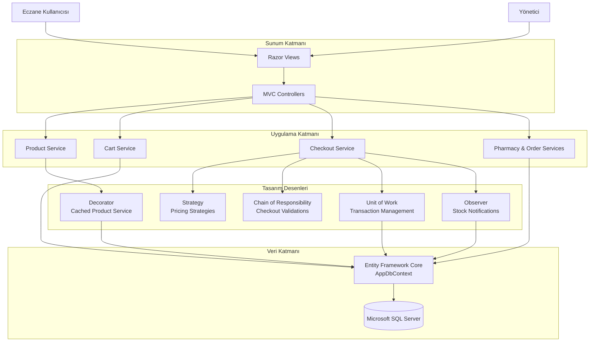
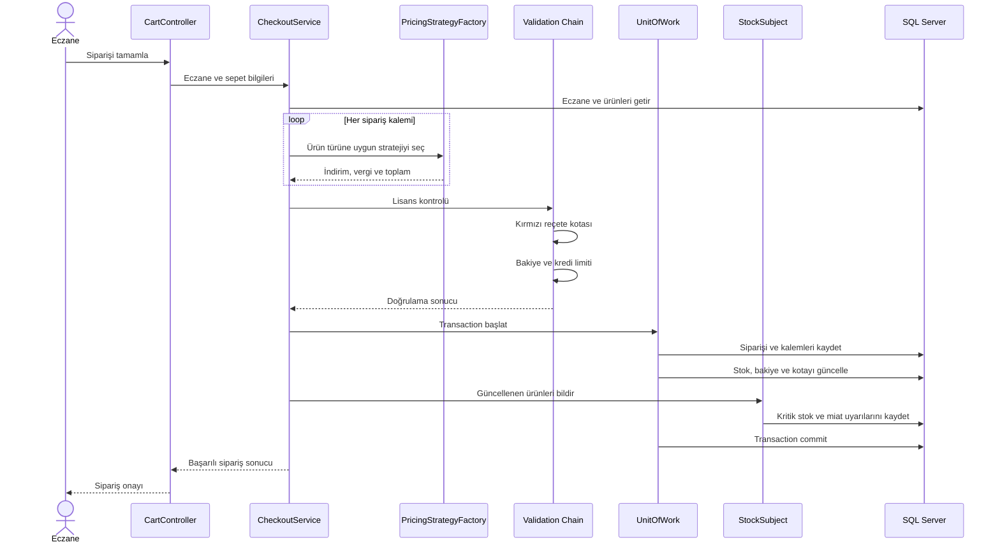

# PharmaSupply


**PharmaSupply**, eczanelerin medikal ürünleri inceleyebildiği, filtreleyebildiği, sepet oluşturabildiği ve güvenli sipariş verebildiği B2B ecza tedarik platformudur.

Proje yalnızca bir e-ticaret arayüzü olarak değil; gerçek iş ihtiyaçlarına karşılık gelen tasarım desenlerini, transaction yönetimini, dinamik veri akışını ve katmanlı uygulama yaklaşımını gösterecek şekilde geliştirilmiştir.

## Projenin Amacı

PharmaSupply aşağıdaki operasyonları tek bir uygulamada birleştirir:

- Ürün, kategori, stok ve reçete bilgilerinin dinamik olarak listelenmesi
- İlaç veya etken madde üzerinden arama yapılması
- Kategori, reçete tipi ve stok durumuna göre filtreleme
- Veritabanında kalıcı sepet yönetimi
- Ürün türüne göre indirim ve vergi hesaplama
- Eczane lisansı, kırmızı reçete kotası ve bakiye doğrulama
- Siparişin transaction içerisinde oluşturulması
- Sipariş sonrası stok, bakiye ve kota bilgilerinin güncellenmesi
- Kritik stok ve yaklaşan miat durumlarında yönetici bildirimi oluşturulması
- Ürün, eczane ve sipariş operasyonlarının Admin Panel üzerinden yönetilmesi

## Uygulama Ekranları

### Kullanıcı tarafı

- **Ana Sayfa:** Kategoriler, çok satan ürünler ve miadı yaklaşan ürünler
- **Ürün Kataloğu:** Sidebar filtreleri, arama ve fiyat sıralaması
- **Ürün Detayı:** Ürün bilgileri, stok, reçete tipi ve sepete ekleme
- **Sepet:** Adet güncelleme, eczane bilgileri ve sipariş tamamlama

### Yönetim tarafı

- **Dashboard:** Ürün, eczane, açık sipariş ve aylık ciro istatistikleri
- **Ürün Yönetimi:** Ürün ekleme, düzenleme, listeleme ve silme
- **Eczane Yönetimi:** Lisans, bakiye, kredi limiti ve reçete kotası takibi
- **Sipariş Yönetimi:** Satın alınan ürünler, adetler, eczane, toplam tutar ve sipariş durumu
- **Akıllı Uyarılar:** Kritik stok ve yaklaşan son kullanma tarihi bildirimleri

## Kullanılan Tasarım Desenleri

Projede toplam beş tasarım deseni, doğrudan bir iş ihtiyacını karşılayacak şekilde uygulanmıştır.

| Tasarım deseni | Kullanım alanı | Sağladığı fayda |
|---|---|---|
| **Chain of Responsibility** | Lisans, kırmızı reçete kotası ve bakiye kontrolleri | Doğrulamaların birbirinden bağımsız ve sıralı çalışmasını sağlar |
| **Unit of Work** | Sipariş, stok, bakiye ve kota güncellemeleri | İlişkili veritabanı işlemlerini tek transaction altında toplar |
| **Strategy** | SGK ilacı ve takviye ürünü fiyatlandırması | Farklı fiyat hesaplama kurallarının kolayca değiştirilebilmesini sağlar |
| **Decorator** | Ürün servisinin önbelleğe alınması | Temel servisi değiştirmeden cache davranışı ekler |
| **Observer** | Stok ve miat değişikliklerinin izlenmesi | Değişiklikleri observer’lara bildirerek yönetici uyarısı ve log üretir |

`PricingStrategyFactory`, ilgili fiyatlandırma stratejisinin seçilmesinden sorumlu yardımcı bileşendir ve Strategy deseninin kullanımını destekler.

## Genel Mimari



## Sipariş Oluşturma Akışı



## Teknoloji Yığını

- **.NET 10**
- **ASP.NET Core MVC**
- **Entity Framework Core 10**
- **Microsoft SQL Server**
- **Razor Views**
- **Dependency Injection**
- **Memory Cache**
- **Bootstrap, özel CSS ve JavaScript**
- **EF Core Migrations**

## Proje Yapısı

```text
PharmaSupply/
├── Controllers/          MVC request ve response akışları
├── Data/                 DbContext, entity modelleri ve Unit of Work
├── Models/               ViewModel ve checkout modelleri
├── Services/
│   ├── Caching/          Decorator implementasyonu
│   ├── Checkout/         Checkout servisi ve doğrulama zinciri
│   ├── Notifications/    Observer implementasyonu
│   └── Pricing/          Strategy ve fiyatlandırma seçimi
├── Views/                Kullanıcı ve Admin Panel Razor ekranları
├── Migrations/           Veritabanı şeması ve seed geçmişi
└── wwwroot/              CSS, JavaScript ve ürün görselleri
```

## Teknik Kazanımlar

Bu projede özellikle aşağıdaki mühendislik konularına odaklanılmıştır:

- Interface tabanlı ve Dependency Injection uyumlu servis tasarımı
- İş kurallarının controller katmanından ayrılması
- Birden fazla veri değişikliğinin transaction güvenliğiyle yürütülmesi
- Genişletilebilir fiyatlandırma ve doğrulama mekanizmaları
- Cache invalidation yönetimi
- Veritabanında kalıcı sepet yapısı
- İlişkili entity’lerin doğru şekilde sorgulanması
- Dinamik ve yönetilebilir Admin Panel verileri
- Okunabilir, sorumlulukları ayrılmış ve sürdürülebilir kod yapısı


